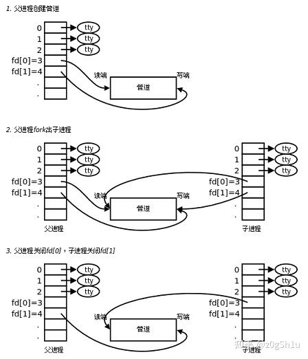
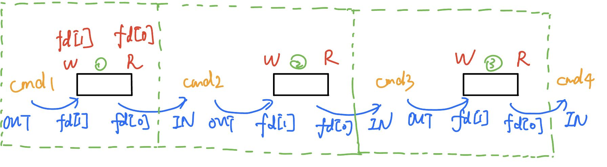

### linux命令执行过程：


### 关于使用的函数的记录
- `chdir()`
  - 功能：`chdir()`用来将当前的工作目录改变成以参数`path`所指的目录。
  - 头文件：`#include <unistd.h>`
  - 定义函数：`int chdir(const char* path)`
  - 返回值：成功返回`0`，不成功返回`-1`
- `getcwd()`
  - 功能：`getcwd()`会将当前工作目录的绝对路径复制到参数`buffer`所指的内存空间中,参数`size`为
    `buffer`的空间大小。
  - 头文件：`#include<unistd.h>`
  - 定义函数：`char *getcwd(char *buf,size_t size)`;
  - 返回值：成功返回指向`buffer `变量的 `char` 类型指针，不成功返回空指针，并发出一些错误信息
  - 注：为什么空指针不用`NULL`而要用`nullptr`？
    在`C++`中`NULL`被解释为`long int`型的`0`，而`nullptr`是`std::nullptr_t`型的值，使用`NULL`表示空指针可能导致二义性。[知乎专栏](https://zhuanlan.zhihu.com/p/79883965)
- `dup2()函数`
  - 功能：执行完`dup2`之后，有`newfd`和`oldfd`同时指向同一个文件
  - 头文件：`#include <unistd.h>`
  - 函数原型：`int dup2(int oldfd, int newfd);`
  - 返回值：成功返回newfd，失败返回-1
- `fork()`
  - 功能：用来创建一个新的进程，该进程几乎是当前进程的一个完全拷贝；
  - 头文件：`include <unistd.h>`
  - 函数原型：`pid_t fork(void)`；
  - 返回值：这个比较难以理解：返回两次。它在调用进程（称为父进程）中返回一次，返回值是新派生进程（称为子进程）的进程ID号，在子进程又返回一次，返回值为0。
    返回值告知我们当前进程是子进程还是父进程。对于一个确定的子进程，可以通过调用`getpid()`取得父进程的pid，但父进程可以有多个子进程

- `wait()`和`waitpid()`函数
  - `wait()`
    - `pid_t  wait(int* status)`:status：输出型参数，拿回子进程的退出信息。不关⼼则可以设置成为NULL，如果参数status不为空，则进程终止状态被保存于其中；
    - 阻塞式等待，等待的子进程不退出时，父进程一直不退出
  - `waitpid()`
    - `pid`
    - 关于`pid`
      - pid>0时，只等待进程ID等于pid的子进程，不管其它已经有多少子进程运行结束退出了，只要指定的子进程还没有结束，waitpid就会一直等下去。
      - pid=-1时，等待任何一个子进程退出，没有任何限制，此时waitpid和wait的作用一模一样。
      - pid=0时，等待同一个进程组中的任何子进程，如果子进程已经加入了别的进程组，waitpid不会对它做任何理睬。
      - pid<-1时，等待一个指定进程组中的任何子进程，这个进程组的ID等于pid的绝对值。

    - 关于`option`
      当options参数为0时，与wait功能相同，仍是阻塞式等待，不提供额外功能。
  - 每次等待一个子进程结束，直到所有子进程都结束（wait()返回0）
    参考于：https://stackoverflow.com/questions/19461744/how-to-make-parent-wait-for-all-child-processes-to-finish
    ```cpp
    while ((wpid = wait(&status)) > 0); // this way, the father waits for all the child processes 
    ```
- `execvp()`
  - 头文件：属于exec()函数的关联函数，包含在`<unistd.h>`中。
  - 函数原型：`int execvp(const char *file, char *const argv[])`
  - 功能：可以将当前进程替换成一个新进程，并且新进程与旧进程具有相同的pid
  - 所需要的参数以`char *args[]`给出，`args[]`的最后一个参数必须要是`nullptr`；
  - 返回值：若成功则不返回，直接被传递至起始点，若出错则返回0；
- `open()`
  - 打开文件可以通过以下两种方式进行：
    - 调用流对象的 open 成员函数打开文件。
    - 定义文件流对象时，通过构造函数打开文件。
  - 头文件：`include<fcntl.h>`
  - 定义函数：`void open(const char* szFileName, int flags, ...)`，第一个参数是指向文件名的指针，第二个参数是文件的打开模式标记，第三个参数（...）仅当创建新文件时才使用，用于指定文件的 访问权限位（access permission bits）。
  - 返回值：成功则返回文件描述符，否则返回-1
  - 文件的打开标志(`flags`)标记了文件的使用方式，这些标记可以单独使用，也可以组合使用，组合时将参数做逻辑或运算**或**构成。
    |模式|解释|
    |--|--|
    |O_RDONLY|只读模式|
    |O_WRONLY|只写模式|
    |O_RDWR  |读写模式|
    打开/创建文件时， 至少得使用上述三个常量中的一个。以下常量是选用的：
    |模式|解释|
    |--|--|
    |**O_APPEND** |**每次写操作都写入文件的末尾**|
    |**O_CREAT** |**如果指定文件不存在，则创建这个文件**|
    |**O_EXCL**|**如果要创建的文件已存在，则返回 -1，并且修改 errno 的值**|
    |**O_TRUNC**|**如果文件存在，并且以只写/读写方式打开，则清空文件全部内容**|
    |O_NOCTTY|如果路径名指向终端设备，不要把这个设备用作控制终端。|
    |O_NONBLOCK |如果路径名指向 FIFO/块文件/字符文件，则把文件的打开和后继 I/O设置为 非阻塞模式（nonblocking mode）| 
    |O_DSYNC|等待物理 I/O 结束后再 write。在不影响读取新写入的数据的前提下，不等待文件属性更新|
    |O_RSYNC |read 等待所有写入同一区域的写操作完成后再进行|
    |O_SYNC |等待物理 I/O 结束后再 write，包括更新文件属性的 I/O|
  - 文件打开的`mode`参数表示设置文件访问权限的初始值，和用户掩码umask有关，比如0644表示-rw-r–r–，也可以用S_IRUSR、S_IWUSR等宏定义按位或起来表示。
    >第三个参数`mode`是在第二个参数`flags`中有O_CREAT时才作用，如果没有，则第三个参数可以忽略
    那么可以理解，在处理重定向时，各个符号对应的模式为：
    - ">": O_RDONLY
    - "<": O_WRONLY | O_CREAT | O_TRUNC, S_IRUSR | S_IWUSR
    - "<<" O_WRONLY | O_CREAT | O_APPEND, S_IRUSR | S_IWUSR

### 关于管道 
参考：http://c.biancheng.net/view/3131.html
- `Linux` 管道使用竖线`|`连接多个命令，这被称为管道符。`Linux` 管道的具体语法格式如下：
  ```shell
    command1 | command2
    command1 | command2 |...|commandN
  ```
- 当在两个命令之间设置管道时，管道符`|`左边命令的输出就变成了右边命令的输入。只要第一个命令向标准输出写入，而第二个命令是从标准输入读取，那么这两个命令就可以形成一个管道。大部分的 `Linux` 命令都可以用来形成管道。
  >这里需要注意，command1 必须有正确输出，而 command2 必须可以处理 command1 的输出结果；而且 command2 只能处理 command1 的正确输出结果，不能处理 command1 的错误信息。

- 父子进程使用管道通信的方法
  
  1、父进程 `pipe`；
  2、父进程 `fork` 两次；
  3、`pid1` 关读端，重定向写端，执行命令，关写端；
  4、`pid2` 关写端，重定向读端，执行命令，关读端；
  5、父进程关闭读、写端，并 `wait`；

- 多于一个管道的操作方法
  
  可以使用递归的方法，在每一层(图中绿线框出来的部分)做如下操作：
  - 将当前指令的OUT端与当前管道的fd[1]端(写端)相连；
  - 除第一个管道以外，将当前指令的IN端与上一个管道的fd[0]端(读端)相连
  直到只剩两个指令，也就是1个管道，处理方法同上
### 关于重定向  
参考：http://c.biancheng.net/view/942.html
- 文件和文件描述符
  |文件描述符|文件名|类型|硬件|
  |--|--|--|--|
  |0|stdin|标准输入文件|键盘|
  |1|stdout|标准输出文件|显示器|
  |2|stderr|标准错误输出文件|显示器|
- 输出重定向是指命令的结果不再输出到显示器上，而是输出到其它地方，一般是文件中。这样做的最大好处就是把命令的结果保存起来，当我们需要  的时候可以随时查询。
- Bash支持的输出的重定向：
  <table>
        <tr>
            <th>类型</th>
            <th>符号</th>
            <th>作用</th>
        </tr>
        <tr>
            <td rowspan = "2">标准输出重定向td>
            <td>command >file</td>
            <td>以覆盖的方式，把 command 的正确输出结果输出到 file 文件中。</td>
        </tr>
        <tr>
            <td>command >>file</td>
            <td>以追加的方式，把 command 的正确输出结果输出到 file 文件中。</td>
        </tr>
        <tr>
            <td rowspan = "2">标准错误输出重定向</td>
            <td>command 2>file</td>
            <td>以覆盖的方式，把 command 的错误信息输出到 file 文件中。</td>
        </tr>
        <tr>
            <td>command 2>>file</td>
            <td>以追加的方式，把 command 的错误信息输出到 file 文件中。</td>
        </tr>
        <tr>
            <td rowspan = "4">正确输出和错误信息同时保存</td>
            <td>command >file 2>&1|</td>
            <td>以覆盖的方式，把正确输出和错误信息同时保存到同一个文件（file）中。</td>
        </tr>
        <tr>
            <td>command >>file 2>&1</td>
            <td>以追加的方式，把正确输出和错误信息同时保存到同一个文件（file）中。</td>
        </tr>
        <tr>
            <td>command >file1 2>file2</td>
            <td>以覆盖的方式，把正确的输出结果输出到 file1 文件中，把错误信息输出到 file2 文件中。</td>
        </tr>
        <tr>
            <td>command >>file1  2>>file2</td>
            <td>以追加的方式，把正确的输出结果输出到 file1 文件中，把错误信息输出到 file2 文件中。</td>
        </tr>
  </table>

- Bash支持的输出重定向
  |符号|说明|
  |--|--|
  |command <file | 将 file 文件中的内容作为 command 的输入。|
  |command <<END|从标准输入（键盘）中读取数据，直到遇见分界符 END 才停止（分界符可以是任意的字符串，用户自己定义）。|
  |command <file1 >file2|将 file1 作为 command 的输入，并将 command 的处理结果输出到 file2。|

- 注意
  - 输出重定向的完整写法其实是`fd>file`或者`fd>>file`，其中`fd` 表示文件描述符，如果不写，默认为 `1`，也就是标准输出文件。当文件描述符为 `1` 时，一般都省略不写。
  - 需要重点说明的是，`fd`和`>`之间不能有空格，否则 `Shell` 会解析失败；`>`和`file`之间的空格可有可无。为了保持一致，习惯在`>`两边都不加空格。
  - 和输出重定向类似，输入重定向的完整写法是`fd<file`，其中 `fd` 表示文件描述符，如果不写，默认为 `0`，也就是标准输入文件。

- 鉴于本次实验只是一个简单的shell并且以空格区分指令的各个部分，所以如果命令中有重定向或管道，只考虑：
  1、 **不含内建命令**
  2、 **若有重定向，有且仅有一个重定向，并且只可能在命令的开头或末尾，但不限`>`、`>>`、`<`**
  3、 **支持两个以上管道**
  4、 **管道和重定向可以同时存在，但满足上面三条条件**
  5、 **`|`、`<`、`>`、`>>`与其他字符间总有一个空格区分**


### 重定向与管道的区别
乍看起来，管道也有重定向的作用，它也改变了数据输入输出的方向，但管道和重定向之间有根本上的不同：

简单地说，重定向操作符`>`将命令与文件连接起来，用文件来接收命令的输出；而管道符`|`将命令与命令连接起来，用第二个命令来接收第一个命令的输出。
显然有：
-  `|`左边的命令应该有标准输出， `|` 右边的命令应该能接受标准输入；
    `>`左边的命令应该有标准输出 `>` 右边只能是文件；
    `<`左边的命令应该需要标准输入 `<<`右边只能是文件；
    `<<`左边的命令应该需要标准输入 `<<`右边只能是文件；

- 管道触发两个子进程执行 `|` 两边的程序，而重定向是在**一个进程**内执行。

- 在shell命令解析前，首先检查的是一定检查好它的输入、输出，也就是0、1、2 设备是否准备好，所以重定向优先级会最高。
   所以我们操作的逻辑应该是：
   1、**先判断是否有管道**
   2、**没有管道则执行命令，有管道就递归分进程**
   3、**执行命令先判断是否是内建命令，是就直接执行，不是则是外部命令**
   4、**是外部命令先判断是否存在重定向，是则分离重定向的文件名，再执行单个命令，不是则直接执行命令**


### CTRL+C信号的处理
- `signal()`函数
  - 省流版：`signal(registered signal, signal handler)`;
- 注意在换行后还需要进行清空缓冲区的处理，否则将输不出来新的一行，需要新输入才能显示。
- 为了让中断之后的输出能正常输出，我们需要刷新输出缓冲区：
  来自`chatgpt`：
  `std::cout.flush()`是用于刷新输出缓冲区的函数。它会将所有未输出的内容刷新到输出设备中，即使输出缓冲区并未被填满。如果不调用该函数，程序可能会在终止前无法完全输出所有的内容。
### C++ char* 与 std::string的转换
- std::string到char*
  ```cpp
    char* a;
    std::string b;
    a = b.c_str();
  ```
- char*到std::string
  ```cpp
    char* a;
    std::string b;
    b = (std::string)a;
  ```
### C++ unordered_map容器
`unordered_map容器`相当于string类与string类的二元对应关系：
- nordered_map 容器和 map 容器仅有一点不同，即 map 容器中存储的数据是有序的，而 unordered_map 容器中是无序的。
- 头文件：`#include <unordered_map>`
- 功能很多：现用现查 
  在`alias`中(重命名)可能用到的函数有这些：
  - begin()
  - end()
  - empty()
  - size()

### C++ 文件读写学习
- 本实验中我们需要将输入过的历史记录在历史记录中，而历史记录应该不止记录当前terminal所输入的历史，还应该记录之前所有的历史记录。
- 当然，删除根目录下的/.zsh_cmd_history就能删除所有历史记录。笔者使用的是zsh不是bash，所以实现`history n`时输出的是从第`n`个到最近的所有历史记录。

具体操作现用现查：
- 包含头文件：`#include <fstream>`
- 创建流对象：`ifsteam f`或`ofstream f`
- 打开文件
  `f.open("path", 打开方式);`
  path是char*型的。
  - ios::in 读文件
  - ios::out 写文件（覆盖写）
  - ios::binary 二进制方式
  - ios::app 追加写（要配合out使用）
  - ios::trunc 覆盖写（要配合out使用）
  - ios::out | ios::binary 二进制写
### C++的值传递和引用传递
指针传递和引用传递一般适用于：

函数内部修改参数并且希望改动影响调用者。对比指针/引用传递可以将改变由形参“传给”实参（实际上就是直接在实参的内存上修改，

不像值传递将实参的值拷贝到另外的内存地址中才修改）。

另外一种用法是：当一个函数实际需要返回多个值，而只能显式返回一个值时，可以将另外需要返回的变量以指针/引用传递

给函数，这样在函数内部修改并且返回后，调用者可以拿到被修改过后的变量，也相当于一个隐式的返回值传递吧。