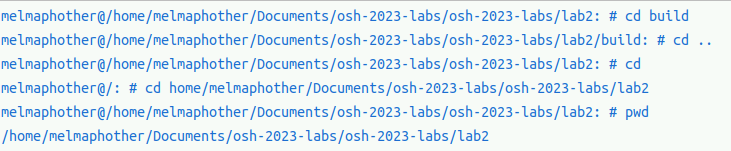
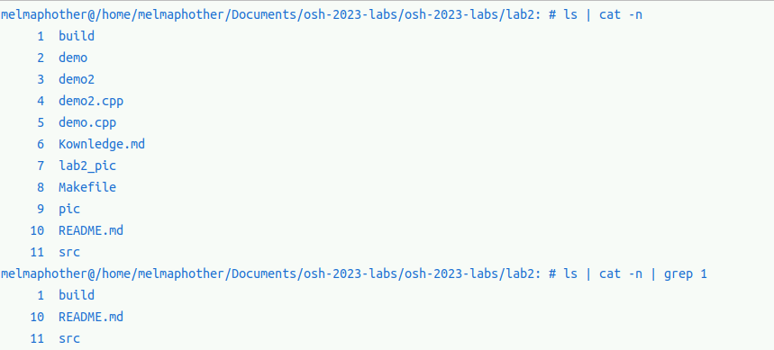
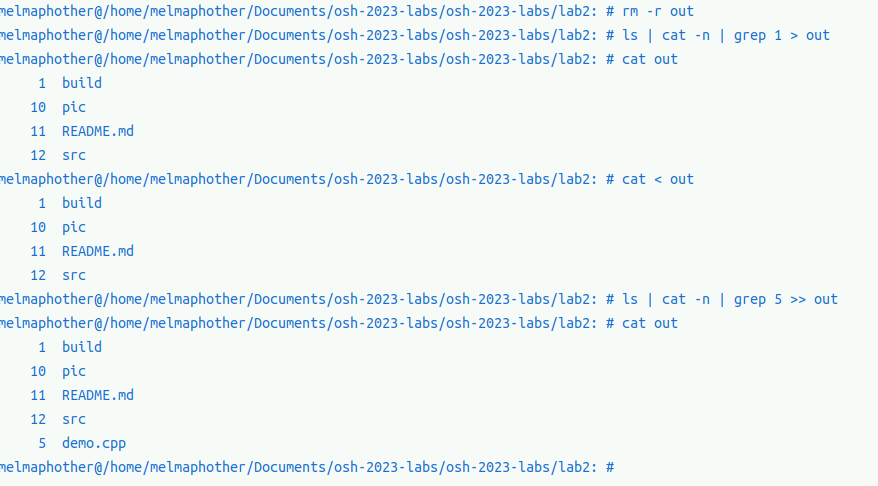
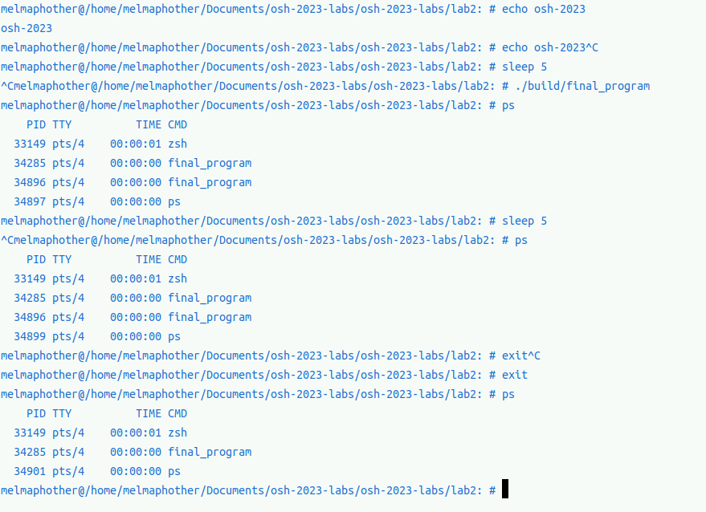
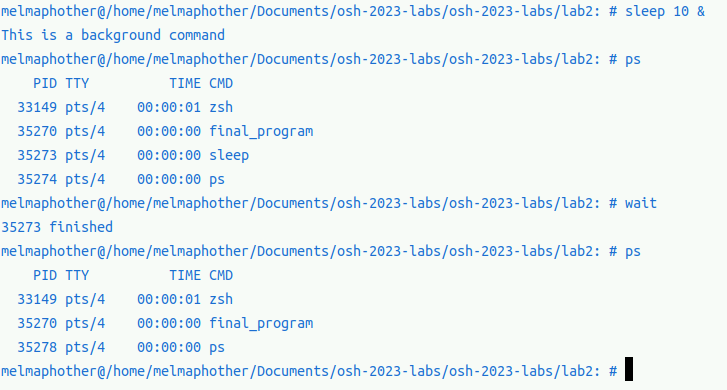
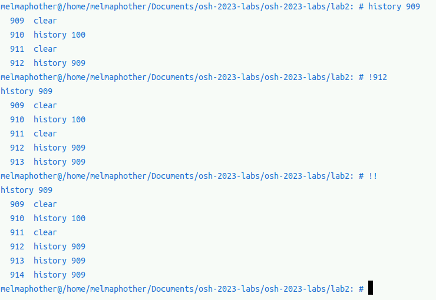
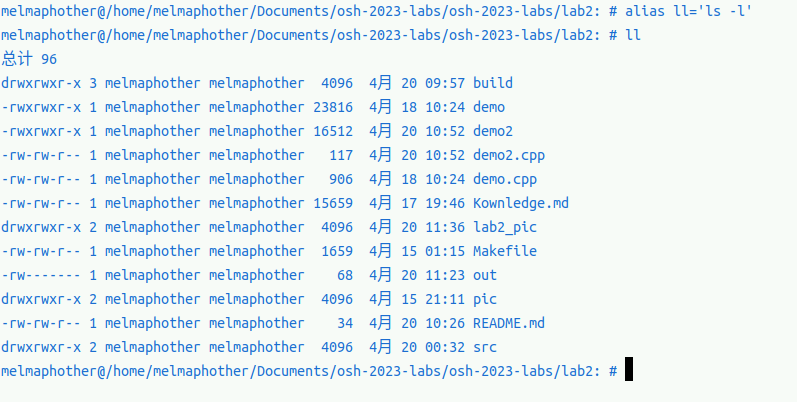
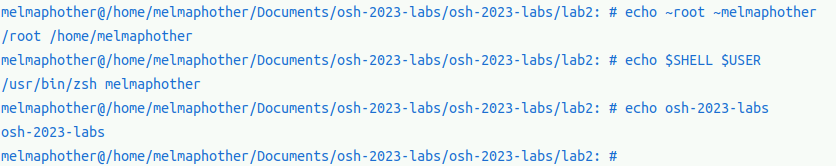

## 综述
- **姓名：王道宇**
- **学号：PB21030794**
- 可以在`lab2`目录下使用命令：
  ```txt
  make
  ```
  来生成可执行文件。
  `make`会在根目录`lab2`下生成一个`build`文件夹，文件夹下有`src`文件夹保存了所有`cpp`文件的中间文件，包括`.d`、`.o`文件，以及`shell`可执行文件，可以使用命令：
  ```txt
  ./build/shell
  ```
  来运行它。
  
- 文件框架
  ```txt
  .
  ├── build
  │   ├── final_program
  │   └── src
  │       ├── main.cpp.d
  │       ├── main.cpp.o
  │       ├── shell.cpp.d
  │       └── shell.cpp.o
  ├── lab2_pic
  │   ├── alias.png
  │   ├── background.png
  │   ├── cd_and_pwd.png
  │   ├── ctrl+d.png
  │   ├── echo.png
  │   ├── history.png
  │   ├── pipe.png
  │   ├── redir.png
  │   └── signal.png
  ├── Makefile
  ├── README.md
  ├── record_pic
  │   ├── morepipes.jpg
  │   └── pipe.jpg
  ├── Records.md
  └── src
      ├── main.cpp
      ├── shell.cpp
      └── shell.h

  5 directories, 22 files

  ```
- 代码框架：
  - main.cpp
  ```cpp
    main.cpp
    int main(){
      exe_ctrl_c;
      read_history_from_file;
      while(){
          exe_ctrl_d;
          cin << cmd;
          alias cmd;
          exe special cmd like !!;
          fork;
          exe_signal;
      }
    }
  ```
  - shell.cpp
  ```cpp
  shell.cpp
  ExePipe
     - ExeWithoutPipe
        -- ExeBuildinCmd
        -- ExeExternalCmd
           --- ExeCmdWithoutPipe
              ---- ExeSingleCmd
  ```
## 实验实现的功能
### 目录导航：
- **必做**
  - `cd`    10%
  - `pwd`    10%
- **选做**
  - 当`cd`命令没参数时，返回根目录    5%
- **结果展示**

### 管道
- **实现两个管道**   10%
- **实现任意长度的管道**   10%

### 重定向
- **支持`<`重定向**    5%
- **支持`>`重定向**    5%
- **支持`>>`重定向**    5%
- **结果展示**

### 信号处理
- **支持ctrl+c丢弃当前命令**
- **ctrl+c正确终止当前运行的进程**
- **ctrl+c在shell嵌套的时候也可以正确终止当前运行的进程**
- **结果展示**

### 前后台进程
- **后台程序运行**    10%
- **`wait`指令等待子进程结束**    10%
- **结果展示**

### 其余功能
**选做**
- **支持历史记录的命令**    5%
  - `history n`
  - `!!`
  - `!n`
  - **结果展示**
  
- **`alias`重命名命令**    5%
  - **结果展示**
  
- **`echo ~`命令**    5%
- **`echo $`命令**    5%
  - **上面两个命令结果展示**
  
- **`ctrl+d`命令**    5%
  - **结果展示**
  
## 注释
- 选做一共做了**30%**