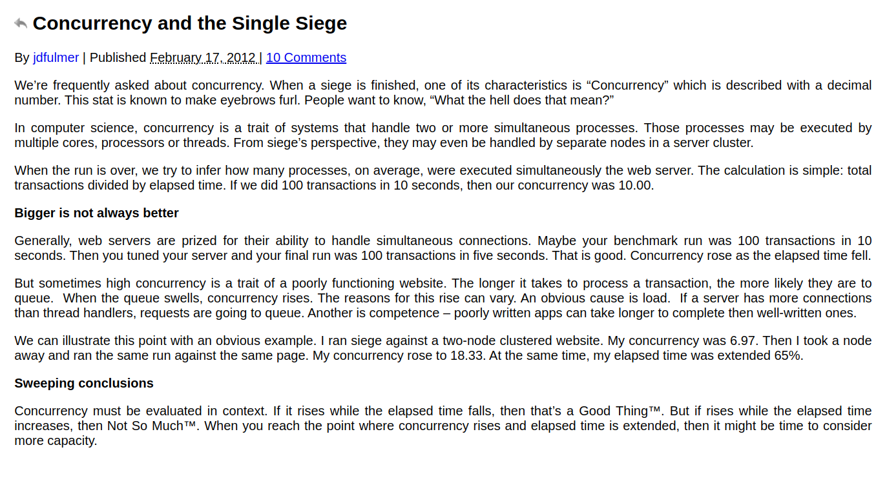
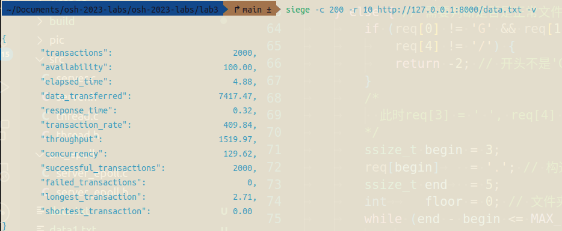

## OSH Lab3 实验报告

### 简述

- 文件夹中包含源文件`src`和`src_epoll`，分别为线程池版本的服务器和`epoll`优化版服务器。

### 编译运行方法

- 在根目录提供了`makefile`，并且默认源是`src`文件夹，默认目标是建立`build`文件夹，在根目录终端输入`make`时，会在根目录下建立`build`文件夹，并将生成的可执行文件`server`放进`build`中，只需要输入:
  
  ```bash
  > ./build/server
  ```
  
  即可运行线程池版本的服务器。
  若需要删除，直接输入`make clean`指令即可删除`build`文件夹。

- 当需要测试`epoll`优化版本的服务器时，请将`makefile`的三、四两行：
  
  ```makefile
  BUILD_DIR := ./build
  SRC_DIRS := ./src
  ```
  
  修改为：
  
  ```makefile
  BUILD_DIR := ./build_epoll
  SRC_DIRS := ./src_epoll
  ```
  
  在根目录终端输入`make`后，即会在根目录下建立`build_epoll`文件夹，，这时，只需要输入：
  
  ```bash
  > ./build_epoll/server
  ```
  
  即可运行`epoll`优化版本的服务器。
  若需要删除，直接输入`make clean`指令即可删除`build_epoll`文件夹。

- 当然，为了比较性能优化的幅度，在根目录下也保留了一个`server.c`文件，这是一个没有使用任何优化的服务器，只需要在终端输入：
  
  ```bash
  > gcc server.c -o server
  ```
  
  即可在根目录下生成一个可执行文件`server`，输入：
  
  ```bash
  > ./server
  ```
  
  即可运行这个服务器。

---

*分割线*

---


### 实验原理

- 服务器具体实现
  
  - 原理：
    
    首先创建服务器端套接字`server_socket`，将套接字与指定的IP、端口绑定，接下来使其进入监听状态，等待客户端发起请求。
    
    接下来创建客户端套接字`client_socket`，进行循环，由于`accept`函数具有阻塞性，当客户端没有连接时，会阻塞在`accept`中，直到有信号进入时，会直接调用`handle`函数，对客户端的请求加以处理。
    
    在处理客户端请求时，需要先读取请求，在读取请求时，需要注意不能认为其一次可以读取完毕，需要循环读取，并且将读取的结果连接起来，并且判断请求头是否是`GET`，直到读到`\r\n\r\n`时停止。根据读的结果截取文件，判断文件类型并返回对应的文件描述符或者错误信号。根据文件描述符向客户端写入信号，若是200信号，可以循环读取文件内容并向客户端写回内容。

- 线程池与多线程
  
  - 原理
    
    每当`server`检测到一个`client`连接时，则创建一个消息通信处理线程，该线程只和这个`client`进行数据通信处理；实际上这是一种多线程并发服务器的实现方案。但是采用多线程并发服务器的处理方式也有一定缺点：
    
    - 每次连接的时候，`server`就需要创建一个数据处理的线程，创建的过程也是需要时间消耗的，当客户端数据传输较快，或者客户端数量较多时，就会影响客户端的处理速度；
    
    - 每当一个`client`退出连接时，我们需要销毁之前创建的数据通信线程，显然销毁的过程也需要时间消耗，也会影响性能速度；
    
    这时可以使用线程池技术：
    
    - `server`端先创建一堆线程池，这个时候因为没有客户端连接，所有线程池都处于阻塞等待状态。
    
    - 每当检测到一个`client`连接时，在线程池中找出一个线程去处理这个客户端，当这个客户端退出时，断开线程和客户端的连接关系，暂时不销毁线程。
    
    - 如果初始创建的线程数量不够，我们需要新增线程；如果由于新增了多个线程之后，由于`client`的退出，我们目前不需要这么多线程，就需要删除多余的线程。

- 实现
  
  定义线程池结构
  
  ```c
  typedef struct threadpool_s {
      pthread_mutex_t lock;           /*用于锁住本结构体*/
      pthread_cond_t queue_empty;     /*当队列任务满时，添加任务的线程阻塞，等待此条件变量*/
      pthread_cond_t queue_not_empty; /*任务队列不为空时，通知等待任务的线程*/
  
      pthread_t *threads;                /*存放线程池中每个线程的tid，数组*/
      int          *task_queue;          /*任务队列*/
  
      int thread_num;                 /*线程池线程数*/
  
      int queue_front;                /*task_queue队头下表*/
      int queue_rear;                    /*task_queue队尾下表*/
      int queue_size;                    /*task_queue队列中实际任务数*/
      int queue_max_size;             /*task_queue队列可容纳任务上限*/
  
      int shutdown;                   /*标志位，线程池使用状态，true或者false*/
  } threadpool_t;
  ```
  
  并定义了关于线程池的几个函数：
  
  ```c
  threadpool_t *threadpool_create(int thread_num, int queue_max_size);
  void         *threadpool_thread(void *threadpool);
  int              threadpool_add(threadpool_t *pool, int client_socket);
  int              threadpool_distory(threadpool_t *pool);
  ```
  
  分别对应着线程池创建函数、线程池工作函数（即在此中调用具体处理函数）、线程池增加函数、线程池销毁函数。
  
  其中，在主函数开始之前，需要调用线程池创建函数，当接收到来自客户端的请求时，可以立刻从线程池中分出一个线程，调用线程池增加函数，增加时就需要使其工作，调用线程池工作函数以从服务器向客户端发送文件。

- `I/O`复用方法`epoll`
  
  - 原理
    
    `epoll`技术是一项`I/O`复用技术，可以提高服务器的并发性能。`epoll`的大致流程如下：
    
    - 创建epoll对象
      
      调用`epoll_create`方法，可以创建一个events对象。它也是文件系统的一员，和socket一样，它也有等待队列。
    
    - 维护监视列表
      
      创建events对象之后，可以用epoll_ctl函数添加或删除所要监听的socket，内核会将加入的socket添加到等待队列中。当socket收到数据后，中断程序会操作events，而不是直接操作进程。
    
    - 接收数据
      
      当socket收到数据后，中断程序会给events的就绪列表添加socket引用，events对象相当于是socket和进程之间的中介，socket的数据接收不影响进程，而是通过改变events的就绪列表改变进程状态。
    
    - 关于边缘触发和水平触发:
      
      epoll支持ET（边缘触发）和LT（水平触发）两种触发方式，其中边缘触发需要设置socket为非阻塞式。
  
  - 具体实现：
    
    - 当`events[i].data.fd == server_socket`时，说明有新的连接进来，但不确定是一个还是多个，所以要用while(1)不断accept（血的教训！！不能直接写一个accept），此时调用epoll_ctl函数时，要把参数设成`EPOLL_CTL_ADD`，表示现在在向等待队列中添加socket。同时把`events[i].data.fd`设成`EPOLLIN|EPOLLET`，
    
    - 当`events[i].data.fd & EPOLLIN`时，说明文件描述符可读，这时可以处理请求，与服务器的流程类似，解析请求，分离文件名并判断，如果是正常文件则打开文件，返回对应的文件描述符。
    
    - 当`events[i].data.fd & EPOLLOUT`时，说明需要写入客户端socket，此时类似服务器的操作，将对应错误信息或正确信息写入客户端。

### 实验结果

- 线程池版本(多线程服务器与线程池差距不大，直接𤭢是线程池了)
  
  - 请求资源路径是正常文件：
    
    
  
  - 请求资源路径是一个目录：
    
    
  
  - 请求资源文件不存在：
    
    
  
  - method不是GET（如method是POST，HTTP标头也同理）：
    
    
  
  - 跳出当前目录？
    
    这里我测试了一下，curl命令如下：
    
    
    
    但是调用read函数之后，read的结果变成了：
    
    
    
    
    
    就好像直接从`..`的后面开始获取文件名？
    
    但是我确实考虑了对应的解决方法：
    
    ```c
        ssize_t begin = 3;
        req[begin]	  = '.'; // 构造相对路径最开始的'.'
    	ssize_t end	  = 5;
    	int		floor = 0; // 文件夹层级
        while (end - begin <= MAX_PATH_LEN &&
    		req[end] != ' ') { // 找到第一个空格停止
    		if (req[end] == '/') {
    			if (req[end - 1] == '.' && req[end - 2] == '.' &&
    				req[end - 3] == '/') {
    				floor--; // 说明到了上级目录
    			} else {
    				floor++;
    			}
    			if (floor < 0) { return -2; } // 已经在当前路径的上级
    		}
    		end++;
    	}
    ```
    
    但是由于read的时候并没有读到`..`，所以这里在超出当前目录时不怎么管用。

- 性能比较
  
  着重考虑三项标准：
  
  - Availability(成功次数百分比)
  
  - Throughput(传输速度)
  
  - Concurrency（实际的最高并发连接数）
  
  有的文档说Concurrency越小说明服务器性能越好，但是在siege官网对其的解释是这样的：
  
  
  
  在最后的总结中说：需要通过实际情况判断并发性指标：如果Concurrency变大但elapsed time变小了，说明这时一件好事，服务器性能有所提高，但如果elapsed time变大了，说明需要考虑容量了。所以下文结合elapsed time来分析服务器性能：
  
  - 正常的服务器：
    
    
  
  - 多线程版本：
    
    
  
  - epoll版本：
    
    
  
  其中data均为4M左右的文件，并发200，重复10次。
  
  可以看到，三个版本均有availability为100%，throughput（传输速度）是多线程最快，普通服务器最慢；而多线程版本的concurrency较高，elapsed time最低，说明服务器性能最好。而epoll的优化居于中心，性能相较于普通的服务器还是有较大提升的。